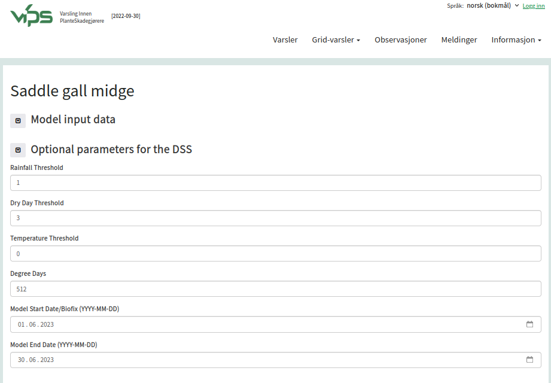

# How to add a DSS available in IPM Decisions into your own DSS

An existing  DSS (external to the IPM Decisions platform) can add a DSS from the 
IPM Decisions platform by using the DSS API, optionally in combination with the 
Weather API. The metadata for each DSS in the platform 
describes all the vital characteristics of the DSS in a machine readable form. This enables 
client software to integrate the DSS with a minimum of code. Once the client code has been 
created for one DSS, adding more DSSs will take only minor additions to the client code.

An example is shown below, where VIPS has integrated the Saddle Gall Midge model created and provided by ADAS. VIPS does not contain any code for calculating the risk, it contains client code for 
* Reading the [IPM Decisions metadata for the Saddle Gall Midge Model](https://platform.ipmdecisions.net/api/dss/rest/model/adas.dss/HAPDMA)
* Creating an input data form based on [those metadata](https://platform.ipmdecisions.net/api/dss/rest/model/adas.dss/HAPDMA/input_schema/ui_form)
* Querying the IPM Decisions Weather API for relevant weather data sources and subsequently (when running the model) getting weather data
* Collating weather data and model input data, and sending it to the ADAS model
* Receiving and displaying the model results returned from ADAS.

[Live page](https://testvips.nibio.no/ipmd/saddlegallmidge/)

[HTML and JavaScript source code](https://gitlab.nibio.no/VIPS/VIPSWeb/-/tree/develop/ipmd)

