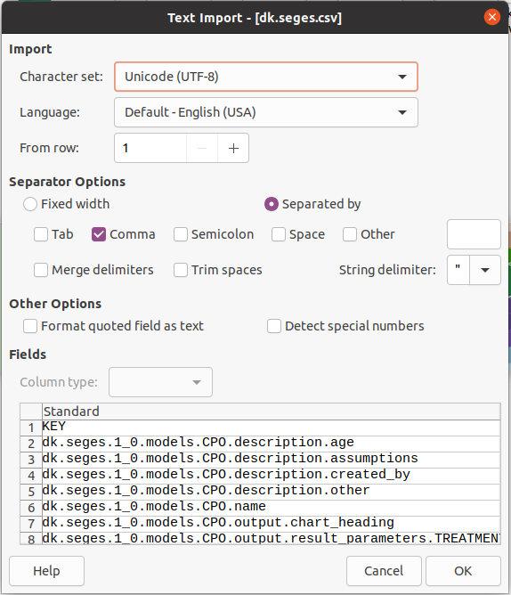
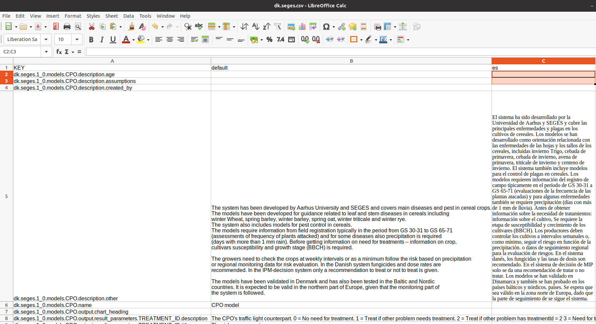

# Internationalization of the API
The DSS metadata contains a lot of verbal content: Descriptions, titles etc that are used in the platform, hence they need translations to as many languages as possible. Internally, the translations are stored as ResourceBundles, which is a Java native way of keeping track of translations.

Creating the translations for one DSS is done by editing a CSV file e.g. using a spreadsheet such as LibreOffice or Excel. It is important that the CSV format is kept throughout the process, so remember to save as or export CSV from your spreadsheet when handing over to the development team.

## Import CSV to spreadsheet
When importing, please set the separator to `,` (comma) and the text delimiter to `"` (double quote). 



When editing, avoid using double quotes in the text.

## Add a new language
To add a new language, simply add the language code in a new column in the top row. Then proceed property by property, adding the translated text



We are using keywords-based way of translating. So, for instance, you have this set of translatable properties for the SEGES metadata:

**Note to self: The translation files should be in a separate GitHub repository, for easy maintenance/bookkeeping**

``` csv

```

