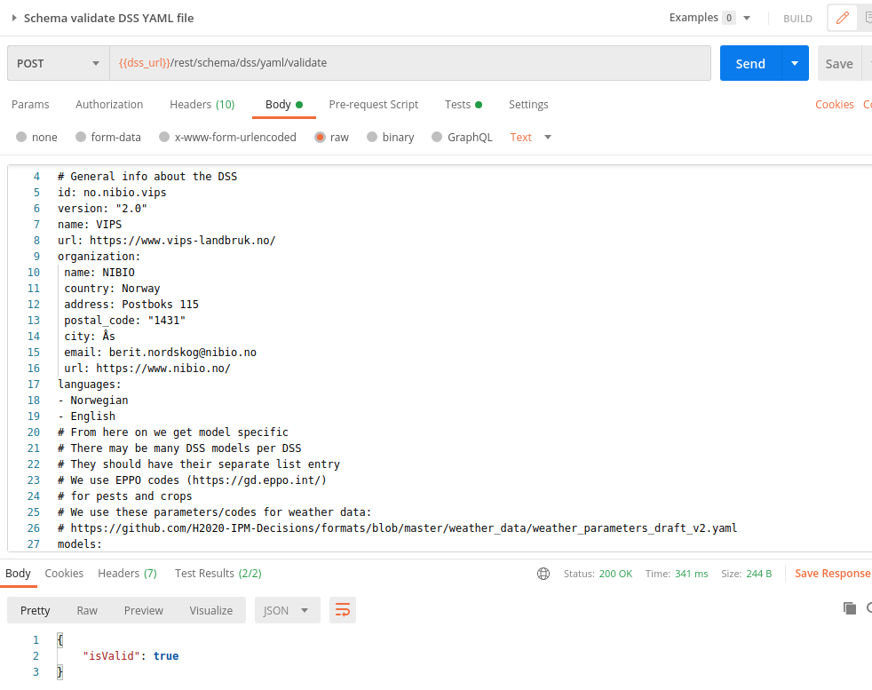

# 2. Register a DSS in the catalogue
The [DSS catalogue](https://ipmdecisions.nibio.no/api/dss/rest/dss) contains the information needed by the platform to 
* List the DSS with its models in the platform
* Make the DSS models searchable by crop, pest, geography and other criteria

If the models are integrated with the platform, it also contains the meta data to
* Enable automatic creation of self validation forms for model inputs
* Create requests to the models
* Receive results and display them in a meaningful way on the platform

## Metadata file format: YAML
Internally, the API stores the meta data about the DSS as a [YAML file](https://en.wikipedia.org/wiki/YAML). The file follows a strict pattern defined in [this schema](https://ipmdecisions.nibio.no/api/dss/rest/schema/dss). (As YAML and Json are interchangeable, the schema has been defined as a [Json schema](https://json-schema.org/)). 

Here's an example of a [valid YAML file](https://ipmdecisions.nibio.no/dss/rest/schema/dss/yaml). An annotated excerpt is given below.

```
# General info about the DSS
id: no.nibio.vips # This uniquely identifies the DSS. Each model also has its id which is unique for this DSS
version: "2.0" # We use this for keeping track of the DSS history
name: VIPS
url: https://www.vips-landbruk.no/
organization: 
 name: NIBIO
 country: Norway
 address: Postboks 115
 postal_code: "1431"
 city: Ås
 email: berit.nordskog@nibio.no
 url: https://www.nibio.no/
languages: # Which languages does the DSS support?
- Norwegian
- English
# From here on we get model specific
# There may be many DSS models per DSS
# They should have their separate list entry
# We use EPPO codes (https://gd.eppo.int/)
# for pests and crops
# We use these parameters/codes for weather data: 
# https://github.com/H2020-IPM-Decisions/formats/blob/master/weather_data/weather_parameters_draft_v2.yaml
models:
- name: Carrot rust fly temperature model
  id: PSILARTEMP
  version: "1.0"
  authors: # List of the model authors
  - name: Berit Nordskog
    email: berit.nordskog@nibio.no
    organization: NIBIO
  pests: 
  - PSILRO # EPPO code for carrot rust fly
  crops:
  - DAUCS # EPPO code for carrot
  keywords: foo, bar, mechanistic, regression # Enhancing searchability for the model
  type_of_decision: Short-term tactical # What kind of decision support does the farmer get from this model?
  type_of_output: Risk indication # What kind of output does the farmer get from this model?
  description_URL: https://www.vips-landbruk.no/forecasts/models/PSILARTEMP/
  description: |
    The warning system model «Carrot rust fly temperature» is based on a Finnish temperature-based model (Markkula et al, 1998; Tiilikkala & Ojanen, 1999; Markkula et al, 2000). The model determines the start of the flight period for the 1st and 2nd generation of carrot rust fly based on accumuleted degree-days (day-degrees) over a base temperature of 5,0 °C. VIPS uses the model for the 1st generation only. 
    Standard air temperature (temperature measured 2 m above ground) is used in the model. Degree-days are defined for this model as the sum of the difference between a base temperature of 5,0 °C and the mean temperature for all days with a temperature >5,0 °C, in other words (daily mean temperature – 5,0 °C) from 1 March (beginning when the ground has thawed).
  citation: null # Optional. Use the DOI as identifier (list)
  # Where has this model been considered valid
  valid_spatial:
    # Using country codes to get GeoJSON. Saves a lot of duplication.
    # ISO-3166-1 Three-letter country codes https://en.wikipedia.org/wiki/ISO_3166-1#Current_codes
    countries:
      - NOR
    # Optionally, use a custom polygon in GeoJson format (https://geojson.org/). The default projection is WGS84(EPSG:4326)
    geoJSON: |-
      {}
  input:
   weather: 
   - parameter_code: 1002 # = Mean air temp at 2m (see https://github.com/H2020-IPM-Decisions/formats/blob/master/weather_data/weather_parameters_draft_v2.yaml for complete list)
     interval: 86400 # Sampling interval in seconds (3600 * 24 = 86400)
  execution: 
    type: ONTHEFLY
    endpoint: https://coremanager.vips.nibio.no/models/PSILARTEMP/run/ipmd # The web service endpoint to send the request to
    form_method: post # Could be get or post
    content_type: application/json # Regular forms: application/x-www-form-urlencoded , Regular forms with files (<input type="file">): multipart/form-data
    # The input template should adhere to the JSON Schema standard: https://json-schema.org/
    # The object of this schema is to enable the client (the platform) to generate a valid request. If user input
    # is needed, there are tools (https://github.com/json-editor/json-editor) available that can auto-generate 
    # self-validating forms
    input_schema: |
      {
        "type":"object",
        "properties": {
          "modelId": {"type": "string", "pattern":"^PSILARTEMP$", "title": "Model Id", "default":"PSILARTEMP", "description":"Must be PSILARTEMP"},
          "configParameters": {
            "title":"Configuration parameters",
            "type": "object",
            "properties": {
              "timeZone": {"type": "string", "title": "Time zone (e.g. Europe/Oslo)", "default":"Europe/Oslo"},
              "timeStart": {"type":"string","format": "date", "title": "Start date of calculation (YYYY-MM-DD)"},
              "timeEnd": {"type":"string","format": "date", "title": "End date of calculation (YYYY-MM-DD)"}
            },
            "required": ["timeZone","timeStart","timeEnd"]
          },
          "weatherData": {
            "$ref": "https://ipmdecisions.nibio.no/api/wx/rest/schema/weatherdata"
          }
        },
        "required": ["modelId","configParameters"]
      }
    # Definition of the result parameters specific for this DSS model
  output: 
    warning_status_interpretation: |-
      Green warning indicates that the flight period has not yet begun.
      Yellow warning indicates that the flight period is beginning and that flies can be coming into the field.
      Red warning indicates peak flight period.
      Grey warning indicates that the flight period of the 1st generation is over.
      Be aware that in areas with field covers (plastic, single or double non-woven covers, etc.) with early crops the preceding season (either on the current field or neighboring fields), the flight period can start earlier due to higher soil temperature under the covers.
    result_parameters:
      # the id is used with the model_id as the namespace
      - id: TMDD5C
        title: Accumulated day degrees
        description: The accumulated day degrees with a base temperature of 5 degrees celcius
```

See [the page on generating api requests](apirequest.md) for details about the input_schema properties. Using the [Json editor](https://json-editor.github.io/json-editor/) and the [Json schema generator](https://www.jsonschema.net/home) can be a great help in creating the schema.

There's a [service for validating your YAML file](https://ipmdecisions.nibio.no/api/dss/apidocs/resource_MetaDataService.html#resource_MetaDataService_validateDSSYAMLFile_POST). The recommended way to use it is to create a request using the [Postman](https://www.postman.com/) application. There's a sample of this in the `/postman_tests/IPM Decisions DSS API tests.postman_collection.json suite` (in the source code): you can import the tests into Postman and duplicate the request in `MetaDataService/Schema validate DSS YAML file`. Just add your YAML text in the body tab and hit "Send", see the illustration below.

